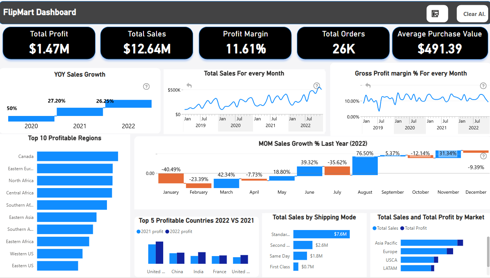
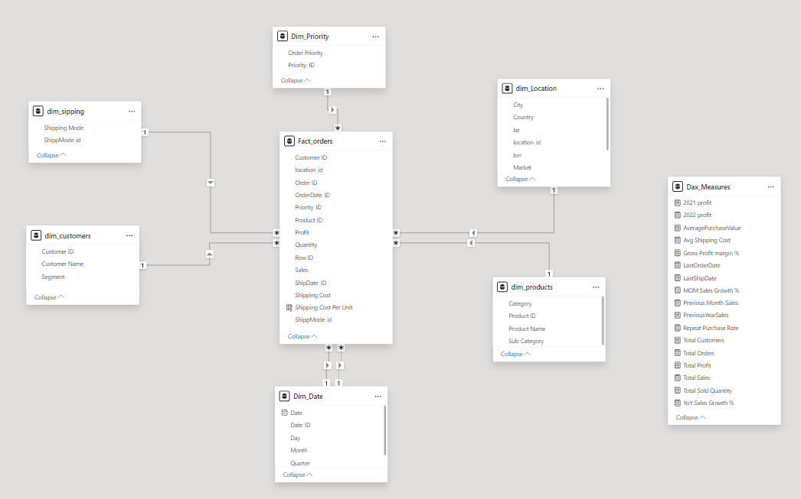

# FlipMart E-commerce Sales Dashboard

## Project Overview

This project focuses on structuring and analyzing e-commerce business data using Power BI and Power Query. Key aspects include:

- **Data Modeling**: Implemented a star schema with fact and dimension tables to optimize performance and scalability.
- **Data Transformation**: Utilized advanced Power Query techniques to clean and organize raw data.
- **Custom Functions**: Developed functions to fetch geospatial data (latitude and longitude) via web APIs.
- **Interactive Dashboards**: Designed Power BI dashboards to visualize key metrics like sales performance and customer behavior.
- **Enhanced User Experience**: Added a pop-up filter pane for intuitive data filtering and exploration.
- **Comprehensive Analysis**: Conducted in-depth analyses to derive actionable business insights.
- **Scalability**: Built a data model accommodating future growth while ensuring optimal performance.

## Visuals
### Main Dashboard 



### Data Model

## Repository Contents

- `FlipMart Full Sales Dashboard.pbix`: Power BI dashboard file.
- `Data/`: Directory containing raw and processed data files.
- `Images/`: Screenshots from the dashboard.
- `README.md`: Project documentation.

## Getting Started

1. **Clone the repository**:
   ```bash
   git clone https://github.com/AhmedAliAli811/Flipmart.git
